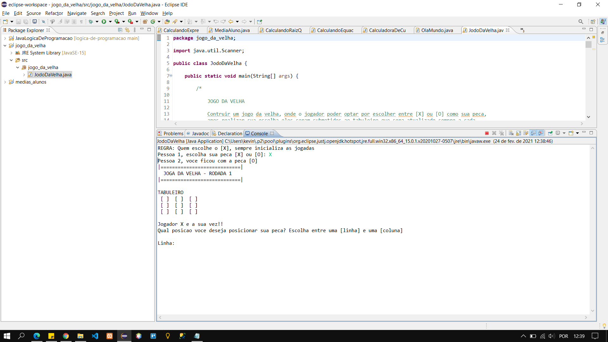

# JOGO DA VELHA

## FUNCIONALIZADADE
 - [x] Logica do sistema
 - [x] Escolha de jogador
 - [x] Insercao de posicao de acordo com a sua peca
 - [x] Validacao de jogada
 - [x] Sistema de vitoria em tempo de execucao

## PROXIMAS FUNCIONALIDADES
 - [x] Construir uma interface grafica
 - [x] Atribuir as pecas com o clique do mouse, sem ter a necessidade de informar a linha e coluna da tabela
 - [x] Registro de pontuacao por jogador